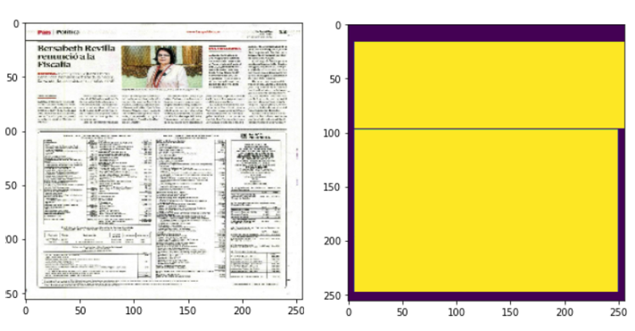

# Newspaper-Multiclass-segmentation-using-UNET

This project focuses on newspaper segmentation using a multiclass model to distinguish between different content sections such as text, images, and advertisements. The model accurately segments various elements in a newspaper layout, enabling efficient extraction and classification for content analysis and digitization purposes.

## Result

  

